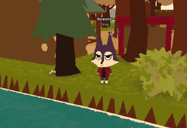

# WebSwimming

You finally took some swimming lessons and you can actually go for a swim in the water without drowning!\
\
<sub>A [WEBFISHING](https://store.steampowered.com/app/3146520/WEBFISHING/) mod using [GDWeave](https://github.com/NotNite/GDWeave/), with a combination of `C#` and `GDScript`.</sub>

## Installation
> **NOTE:** GDWeave is required to use the mod, which can be found [here](https://github.com/NotNite/GDWeave/) if you do not have it yet.

[Download the latest release](https://github.com/Nowaha/WebSwimming/releases/latest/download/WebSwimming.zip) and extract it inside of your `GDWeave/mods` folder, so that it exists as its own folder in there alongside your other mods.

You should end up with this structure:
```
GDWeave/
  mods/
    WebSwimming/
      manifest.json
      WebSwimming.dll
      WebSwimming.pck
```
